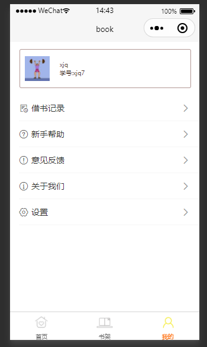
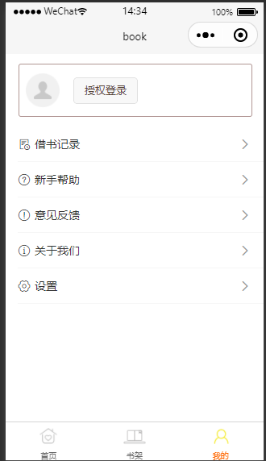
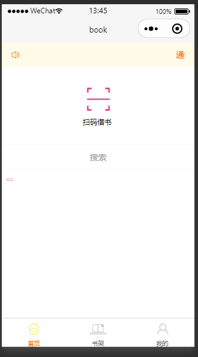
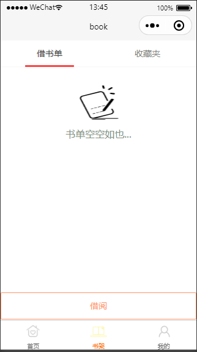
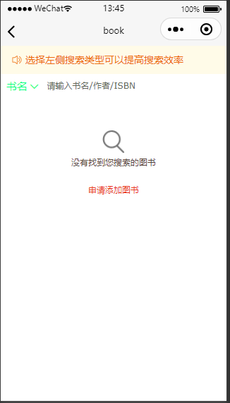
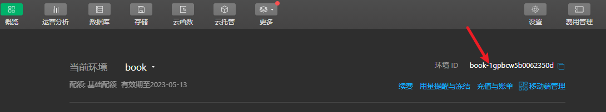
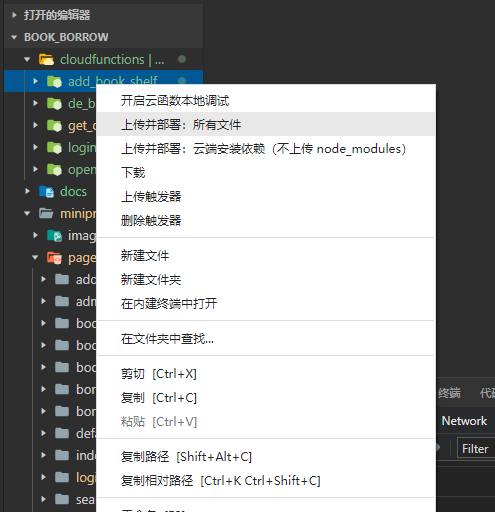
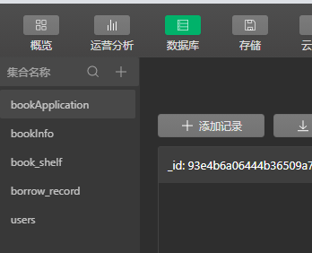

## 效果展示

- 设置用户信息


- 用户信息界面(已登录)



- 用户信息界面(未登录)



- 首页



- 书架



- 图书搜索



## 后台小程序云开发

JSON 数据库,增删查改

### 云开发环境配置

修改 /miniprogram/app.js 中 云开发环境 id 为你自己的

```js
// /miniprogram/app.js  云开发环境 id book-1gpbcw5b0062350d
App({
  onLaunch: function () {
    wx.cloud.init({
      env: 'book-1gpbcw5b0062350d', // 环境 id
      traceUser: true,
    });
    this.getUserInfo();
  },
  globalData: {
    userInfo: {},
    login: false,
    book_shelf: false,
  },
  getUserInfo() {
    let userInfo = wx.getStorageSync('userInfo');
    if (userInfo) {
      this.globalData.userInfo = userInfo;
      this.globalData.login = true;
    }
  },
});
```

云开发控制台



### 云函数

#### 依赖安装

/cloudfunctions 下面的目录, 依次在终端进入 并执行依赖安装命令

```sh
# get_openID
# 进入 /cloudfunctions/get_openID
npm i
```

#### 然后上传并部署所有文件



### 数据库集合创建

创建如下集合

1. bookApplication
2. bookInfo
3. book_shelf
4. borrow_record
5. users



## 功能

1. 扫码借书
2. 添加书单、类似购物车
3. 查看我的借阅记录
4. 登录
